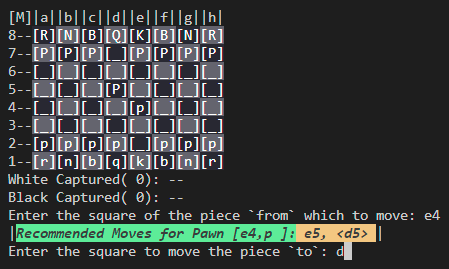
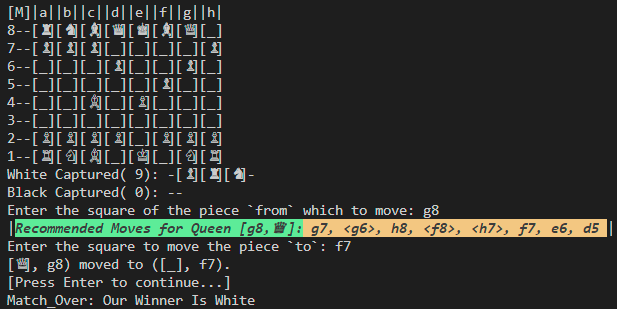
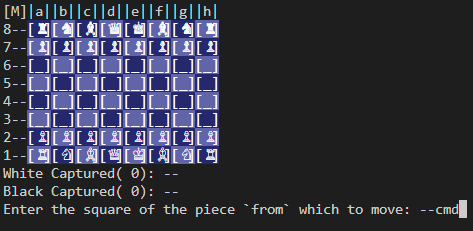
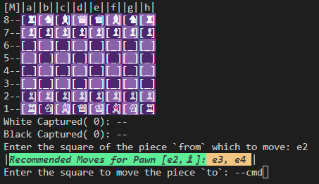

# Features of My Project

This document describes the key features of the project.

## Feature 1: User Interface

The user interface (UI) for this chess game is designed using the **Command Prompt (CMD)** panel. Despite the simplicity of using a command-line interface, the game has been carefully designed to ensure clarity and ease of use for players.

### Key Design Aspects:
- **Clear Visual Representation**: The game board is displayed with proper alignment, ensuring that players can easily identify the pieces and their positions.
- **Color Contrast**: Different colors are used for the chessboard squares to distinguish between black and white squares, making it easier for players to follow the game state.
- **Piece Representation**: Each piece is represented by a single character (e.g., 'P' for pawn, 'R' for rook), ensuring simplicity while maintaining clear identification of each piece.
- **Input Prompts**: The game provides intuitive prompts to guide the player in making moves. Instructions are displayed clearly on the command line, making the user experience smoother.
- **Move Feedback**: After each move, the updated game board is displayed, reflecting the changes and giving instant feedback to the player.

### Benefits:
- **Simple and Lightweight**: The CMD-based UI is easy to implement and doesn’t require heavy resources, making it accessible for all users without the need for complex graphical setups.
- **Focus on Gameplay**: The simplicity of the interface ensures that the player can focus entirely on the game, with no distractions from complex UI elements.

Although the interface is minimalistic, it is designed to provide the best possible clarity and user experience within the constraints of a command-line environment.

### Example:
<div style="display: flex; justify-content: space-between;">
  
  
  
</div>


## Feature 2: Move Generation

This chess game generates proper moves for each piece, including normal moves, attacking moves, En Passant, and Castling.

### Description:
The game handles various types of chess moves, such as:
- **Normal Moves**: The basic movement of each piece according to standard chess rules.
- **Attacking Moves**: The movement of pieces when attacking an opponent’s piece.
- **En Passant**: A special pawn move where a pawn can capture an opponent’s pawn that has just moved two squares forward from its starting position.
- **Castling**: The special move where the king and rook can move simultaneously under certain conditions.

### Move Decorations:
The `get_valid_mv()` method provides decorated moves to clearly distinguish between different types of moves:
- **Normal Moves**: Displayed as regular positions (e.g., `e4`).
- **Attacking Moves**: Displayed with angle brackets (e.g., `<d5>`).
- **En Passant**: Displayed with a quotation mark (e.g., `e6'`).
- **Castling**: Displayed with vertical bars (e.g., `|g1|`).

### Customization:
To disable the move decorations, the programmer can set the `deco` parameter in the `get_valid_mv()` method to `False`. When `deco=False`, the method will return the positions without any decorations.

### How to Get:
The method responsible for generating valid moves is located in the `src/chessboard.py` file, specifically in the function `get_valid_mv()`. This function generates all valid moves for a particular piece based on its position on the board. The optional `deco` parameter allows customization of the output.

### Example:

```python
board = chessboard(board_notation='R3K2R/5p2/8/8/8/8/8/r3k2r')
# Get valid moves for the piece at position 'e1' (King on the 1st rank) with decorations
print(board.get_valid_mv(position='e1')) 
# Output: ['e2', 'f1', 'd1', 'f2', 'd2', '|c1|', '|g1|']

# Get valid moves for the piece at position 'e8' (King on the 8th rank) with decorations
print(board.get_valid_mv(position='e8')) 
# Output: ['e7', 'f8', 'd8', '<f7>', 'd7', '|c8|']

# Get valid moves for the piece at position 'e1' without decorations (deco=False)
print(board.get_valid_mv(position='e1', deco=False)) 
# Output: ['e2', 'f1', 'd1', 'f2', 'd2', 'c1', 'g1']
```

## Feature 3: Provides Commands

This chess game features a command-line interface (CLI) for managing various aspects of the game. The commands are accessed via a special command mode that allows players to control the game state, perform actions, and retrieve game information.

### Description:
The game provides a flexible **command-line interface** through the method `open_cmd`. Players can issue commands to perform actions such as resetting the game, viewing move history, toggling board colors, and checking the game status, enhancing interactivity and control during gameplay.

### How to Use:
During the game, when prompted to enter the 'from square' or 'to square' for moving pieces, type the command `--cmd` to open the command mode. Once in the command panel, you can input any of the supported commands.

- **Example**:

    <div style="display: flex; justify-content: space-between;">
      
      
    </div>

### Supported Commands:
Here’s a list of commands you can use in the command mode:

| Command | Description |
|---------|-------------|
| `--back` | Close the command panel and return to the main game loop. |
| `--end`  | End the game immediately and declare a winner based on capturing scores. |
| `--undo` | Undo the last move, if available. |
| `--rsg`  | Reset the game to its initial state. |
| `--his`  | Display the move history. |
| `--colo` | Toggle the chessboard color display (on/off). |
| `--bn`   | Show the current board notation. |
| `--mvs`  | Display all possible moves for the current player. |
| `--mve`  | Display all possible moves for the opponent. |
| `---`    | Check if the current player is in checkmate and declare a winner if so. |

### Benefits:
- **Enhanced Control**: Players can manage the game state without restarting or exiting.
- **Convenience**: Commands like `--undo` and `--his` make it easier to track and modify gameplay.
- **Flexibility**: Options like toggling board colors and displaying board notation offer customization during the game.
- **Error Handling**: The ability to reset (`--rsg`) and undo moves provides a safety net for mistakes.


## Feature 4: [Move History]
- **Description**: This Project also provides proper record of move history like Moves no., Detailed Notation, Actual Notation, Move Type, Player
- **How to View**: 
  - While Playing
    
  - -hjk
- **Example**: Example code or output.
