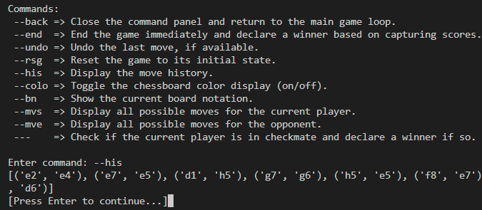

# Features of My Project

This document describes the key features of the project.

## Feature 1: User Interface

The user interface (UI) for this chess game is designed using the **Command Prompt (CMD)** panel. Despite the simplicity of using a command-line interface, the game has been carefully designed to ensure clarity and ease of use for players.

### Key Design Aspects:
- **Clear Visual Representation**: The game board is displayed with proper alignment, ensuring that players can easily identify the pieces and their positions.
- **Color Contrast**: Different colors are used for the chessboard squares to distinguish between black and white squares, making it easier for players to follow the game state.
- **Piece Representation**: Each piece is represented by a single character (e.g., 'P' for pawn, 'R' for rook), ensuring simplicity while maintaining clear identification of each piece.
- **Input Prompts**: The game provides intuitive prompts to guide the player in making moves. Instructions are displayed clearly on the command line, making the user experience smoother.
- **Move Feedback**: After each move, the updated game board is displayed, reflecting the changes and giving instant feedback to the player.

### Customizations:
Programmers can easily customize the user interface to tailor the game to their preferences. The following options are available:

1. **Player Names**:
   - Set custom names for the players by modifying the `PLAYER_NAMES` dictionary.
   ```python
   PLAYER_NAMES = { 
        'white': "Magnus Carlsen",
        'black': "Hikaru Nakamura"
   }
   ```
   - These names are displayed during gameplay to enhance personalization.

2. **UI Settings**:
   - Customize key UI elements using the `UI_SETTINGS` dictionary.
   ```python
   UI_SETTINGS = {
       "Player's Name On Corner": True,   # Display player names at the board's corners
       "Display Colored Board": True,    # Enable or disable colored board display
   }
   ```

3. **Chessboard Colors**:
   - Adjust the RGB values for the chessboard background and piece display to create a custom visual theme.
   ```python
   R, G, B = (30, 0, 70)  # Adjust these values (r >= 60, g >= 20, b >= 80)
   ```
   - **Note**: The minimum thresholds ensure optimal contrast and readability.

4. **Piece Representation**:
   - If the game is run in the CMD panel (not in VS Code's terminal), chess pieces may appear as `[?]`. To address this, programmers can customize how the pieces are displayed by modifying the constant variable `REPRESENT_PIECE_WITH` in `chessboard_piece.py`.
   - Options for representation:
     - **'Symbol'**: Use symbols for pieces (e.g., ♟︎, ♞, ♝).
     - **'Letter'**: Use letters for pieces (e.g., P, N, B).

   ```python
   # line 4; chessboard_piece.py
   REPRESENT_PIECE_WITH = 'Symbol'  # 'Symbol' or 'Letter'

   PIECE_SYMBOLS = {
       'Symbol':{'Pawnb': "[♟︎]", 'Knightb': "[♞]", 'Bishopb': "[♝]", 'Rookb': "[♜]", 'Queenb': "[♛]", 'Kingb': "[♚]",
                 'Pawnw': "[♙]", 'Knightw': "[♘]", 'Bishopw': "[♗]", 'Rookw': "[♖]", 'Queenw': "[♕]", 'Kingw': "[♔]"},
       'Letter':{'Pawnb': "[P]", 'Knightb': "[N]", 'Bishopb': "[B]", 'Rookb': "[R]", 'Queenb': "[Q]", 'Kingb': "[K]",
                 'Pawnw': "[p]", 'Knightw': "[n]", 'Bishopw': "[b]", 'Rookw': "[r]", 'Queenw': "[q]", 'Kingw': "[k]"},
   }
   ```
   - **Note**: Programmers can also create their own custom piece representations by adding to the `PIECE_SYMBOLS` dictionary.


### Benefits:
- **Simple and Lightweight**: The CMD-based UI is easy to implement and doesn’t require heavy resources, making it accessible for all users without the need for complex graphical setups.
- **Personalized Experience**: Custom player names and UI settings add a personal touch to the game.
- **Improved Visuals**: Flexible options for adjusting board colors enhance the visual clarity and appeal.
- **Focus on Gameplay**: The minimalistic design ensures that players can focus entirely on the game without distractions from unnecessary UI elements.

Although the interface is minimalistic, it is designed to provide the best possible clarity and user experience within the constraints of a command-line environment.

### Examples:
| UI When Piece represented with Symbols | UI When Piece represented with Letters | UI When "Display Colored Board" is False |          
|----------------------------------------|----------------------------------------|------------------------------------------|
|  |  |  |


## Feature 2: Move Generation

This chess game generates proper moves for each piece, including normal moves, attacking moves, En Passant, and Castling.

### Description:
The game handles various types of chess moves, such as:
- **Normal Moves**: The basic movement of each piece according to standard chess rules.
- **Attacking Moves**: The movement of pieces when attacking an opponent’s piece.
- **En Passant**: A special pawn move where a pawn can capture an opponent’s pawn that has just moved two squares forward from its starting position.
- **Castling**: The special move where the king and rook can move simultaneously under certain conditions.

### Move Decorations:
The `get_valid_mv()` method provides decorated moves to clearly distinguish between different types of moves:
- **Normal Moves**: Displayed as regular positions (e.g., `e4`).
- **Attacking Moves**: Displayed with angle brackets (e.g., `<d5>`).
- **En Passant**: Displayed with a quotation mark (e.g., `e6'`).
- **Castling**: Displayed with vertical bars (e.g., `|g1|`).

### Customization:
To disable the move decorations, the programmer can set the `deco` parameter in the `get_valid_mv()` method to `False`. When `deco=False`, the method will return the positions without any decorations.

### How to Get:
The method responsible for generating valid moves is located in the `src/chessboard.py` file, specifically in the function `get_valid_mv()`. This function generates all valid moves for a particular piece based on its position on the board. The optional `deco` parameter allows customization of the output.

### Example:

```python
board = chessboard(board_notation='R3K2R/5p2/8/8/8/8/8/r3k2r')
# Get valid moves for the piece at position 'e1' (King on the 1st rank) with decorations
print(board.get_valid_mv(position='e1')) 
# Output: ['e2', 'f1', 'd1', 'f2', 'd2', '|c1|', '|g1|']

# Get valid moves for the piece at position 'e8' (King on the 8th rank) with decorations
print(board.get_valid_mv(position='e8')) 
# Output: ['e7', 'f8', 'd8', '<f7>', 'd7', '|c8|']

# Get valid moves for the piece at position 'e1' without decorations (deco=False)
print(board.get_valid_mv(position='e1', deco=False)) 
# Output: ['e2', 'f1', 'd1', 'f2', 'd2', 'c1', 'g1']
```

### Benefits:
- Comprehensive Move Logic: The get_valid_mv() method handles all possible movements, ensuring accurate and realistic gameplay.
- Move Decorations: The use of decorations clearly indicates different types of moves, improving the readability of valid move options.
- Customization: The ability to disable move decorations (by setting deco=False) gives flexibility to the programmer or user based on preference.
- Special Move Handling: Special moves like En Passant and Castling are integrated, adhering to the official chess rules.

## Feature 3: Provides Commands

This chess game features a command-line interface (CLI) for managing various aspects of the game. The commands are accessed via a special command mode that allows players to control the game state, perform actions, and retrieve game information.

### Description:
The game provides a flexible **command-line interface** through the method `open_cmd`. Players can issue commands to perform actions such as resetting the game, viewing move history, toggling board colors, and checking the game status, enhancing interactivity and control during gameplay.

### How to Use:
During the game, when prompted to enter the 'from square' or 'to square' for moving pieces, type the command `--cmd` to open the command mode. Once in the command panel, you can input any of the supported commands.

**Examples**:
| Example of entering CMD mode 1 | Example of entering CMD mode 2 |
|--------------------------------|--------------------------------|
|  |  |

### Supported Commands:
Here’s a list of commands you can use in the command mode:

| Command | Description |
|---------|-------------|
| `--back` | Close the command panel and return to the main game loop. |
| `--end`  | End the game immediately and declare a winner based on capturing scores. |
| `--undo` | Undo the last move, if available. |
| `--rsg`  | Reset the game to its initial state. |
| `--his`  | Display the move history. |
| `--colo` | Toggle the chessboard color display (on/off). |
| `--bn`   | Show the current board notation. |
| `--mvs`  | Display all possible moves for the current player. |
| `--mve`  | Display all possible moves for the opponent. |
| `---`    | Check if the current player is in checkmate and declare a winner if so. |

### Benefits:
- **Enhanced Control**: Players can manage the game state without restarting or exiting.
- **Convenience**: Commands like `--undo` and `--his` make it easier to track and modify gameplay.
- **Flexibility**: Options like toggling board colors and displaying board notation offer customization during the game.
- **Error Handling**: The ability to reset (`--rsg`) and undo moves provides a safety net for mistakes.


## Feature 4: Move History

This project keeps a comprehensive record of the move history, including details like:
- **Move Number**: The sequential number of each move.
- **Detailed Notation**: A descriptive notation for each move.
- **Actual Notation**: The standard chess notation.
- **Move Type**: Indicates whether the move is normal, attacking, En Passant, or Castling.
- **Player**: The player (White or Black) who made the move.

### How to View:

- #### While Playing:
  - ***Step-1***: During the game, when prompted to enter the 'from square' or 'to square' for moving pieces, type the command `--cmd` to open the command mode.
  - ***Step-2***: Enter the command `--his` to display the move history.
    
| Example of using cmd --his |
|------------------------------------------|
|  |

- #### Directly Through `moves_his.txt` File:
  - The program simultaneously records move history in a file named `moves_his.txt` located in the `src` folder (the same location as `chessboard_.py`).
  - You can check the file for a complete record of the game’s move history.
    
    **Example**: [Location of `moves_his.txt`](src/moves_his.txt)

### Customizations:
Programmers can customize how the move history is recorded by modifying constant variables in `chessboard_.py`:
  1. **Enable or Disable Move Recording in File**:
      - Set the value of `MAKE_RECORD_OF_MOVES_IN_OTHER_FILE` to `True` (to enable) or `False` (to disable).

  2. **Change File Path**:
      - Update the value of `MOVES_HISTORY_PATH` to specify a different file path for the move history.

   **Code Example**:
   ```python
   # Lines 10 and 11 in chessboard_.py
   # SOME IMPORTANT VARIABLES
   MAKE_RECORD_OF_MOVES_IN_OTHER_FILE = True  # Enables file recording
   MOVES_HISTORY_PATH = 'moves_his.txt'       # Default file path
   ```
   
### Benefits:
- **Detailed Tracking**: Provides a clear and organized record of moves for analysis or review.
- **In-Game Access**: Players can view move history during the game without pausing or restarting.
- **Customizable Options**: Programmers can enable/disable recording or modify the file path as per their requirements.
- **Persistence**: The `moves_his.txt` file ensures that move history is saved for later reference, even after the game ends.

