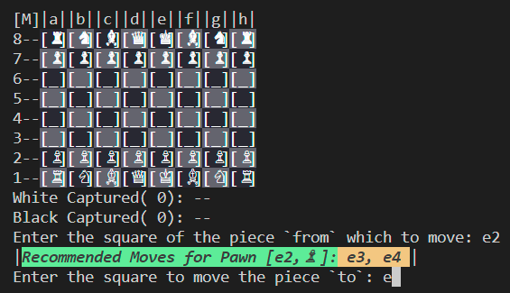

# Features of My Project

This document describes the key features of the project.

## Feature 1: User Interface

The user interface (UI) for this chess game is designed using the **Command Prompt (CMD)** panel. Despite the simplicity of using a command-line interface, the game has been carefully designed to ensure clarity and ease of use for players.

### Key Design Aspects:
- **Clear Visual Representation**: The game board is displayed with proper alignment, ensuring that players can easily identify the pieces and their positions.
- **Color Contrast**: Different colors are used for the chessboard squares to distinguish between black and white squares, making it easier for players to follow the game state.
- **Piece Representation**: Each piece is represented by a single character (e.g., 'P' for pawn, 'R' for rook), ensuring simplicity while maintaining clear identification of each piece.
- **Input Prompts**: The game provides intuitive prompts to guide the player in making moves. Instructions are displayed clearly on the command line, making the user experience smoother.
- **Move Feedback**: After each move, the updated game board is displayed, reflecting the changes and giving instant feedback to the player.

### Benefits:
- **Simple and Lightweight**: The CMD-based UI is easy to implement and doesn’t require heavy resources, making it accessible for all users without the need for complex graphical setups.
- **Focus on Gameplay**: The simplicity of the interface ensures that the player can focus entirely on the game, with no distractions from complex UI elements.

Although the interface is minimalistic, it is designed to provide the best possible clarity and user experience within the constraints of a command-line environment.

### Example:

  
  

